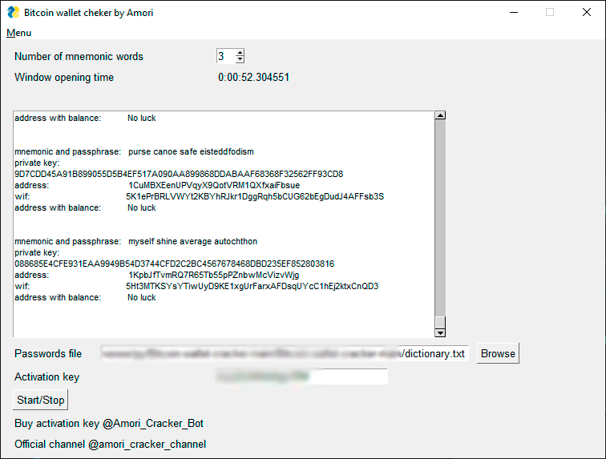

# Amori Bitcoin Cracker
```
Automated Bitcoin wallet generator. With mnemonic and passphrases bruteforces wallet addresses.

```

# How to use
```
1. Run "bc.exe"
2. Specify the number of mnemonic words (we recommend 12)
3. Select the "dictionary.txt" file for the "Password file field"
4. Press "Start button"
5. Address with balance is saved in txt file "win.txt"
```

### Example
```
address: 17wd4CFhKPYfbo6YwmTFU4xH4hDkd13AJF
private key: 0651863bf5d902262b17c4621ec340544ff016752543d99a92d7d22872d8a455
WIF private key: 5Hs4yg5HYcAmS97UPgmj54V6Lvmv1yKf4yGWs4qcwkWjB5FFnaz
public key: 040577b1aa3256fed819174b1e6557d4b269f42e383df393b1e8a4c6b9d117994
bc476304738fb948cec05a5d17d0fe6f996e7ec0b4a8e2853e41d6657f3f41e33

```

[Official Channel](https://t.me/amori_cracker_channel)

[Buy activation key](https://t.me/Amori_Cracker_Bot)

# Disclaimer

**This programm within this repository comes with no guarantee, the use of this code is your responsibility. I take NO responsibility and/or liability for how you choose to use any of this programm available here. By using any of the files available in this repository, you understand that you are AGREEING TO USE AT YOUR OWN RISK.**


